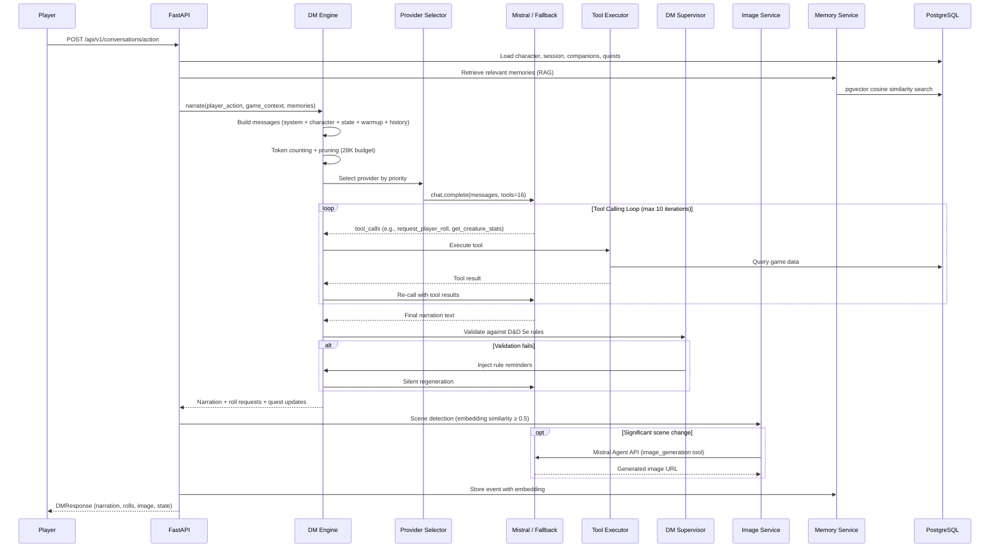

# Mistral Realms

**A full-stack AI-powered D&D platform built on Mistral's APIs** — agents, tool calling, embeddings, and image generation — with a multi-provider fallback architecture, RAG memory, agentic DM supervision, distributed tracing, and 30,000+ D&D 5e content entries, all containerized with full observability.

> Built in ~10 weeks as an internship application for [Mistral AI](https://mistral.ai)

---

## What This Is

Mistral Realms is a playable Dungeons & Dragons experience where an AI Dungeon Master narrates your adventure, calls game-mechanic tools (dice rolls, HP updates, spell slots, creature lookups), generates scene images, and maintains long-term memory — all through Mistral's APIs. The system handles provider failures gracefully, validates AI responses against D&D 5e rules, and provides full observability into every AI call.

### What makes this interesting for Mistral engineers

- **Mistral Agents API for image generation**: A persistent agent with the `image_generation` tool creates scene illustrations. The agent is created once and reused via stored ID, with 429 cooldown tracking, hash-based deduplication, and hourly quotas.
- **16 tool-calling functions** defined in Mistral's format: the DM calls `request_player_roll`, `update_character_hp`, `consume_spell_slot`, `get_creature_stats`, `search_items`, `give_item`, `search_memories`, `search_monsters`, `search_spells`, `roll_for_npc`, `introduce_companion`, `companion_suggest_action`, `companion_share_knowledge`, and more — with a multi-iteration agent loop (max 10 rounds of tool calls per turn).
- **Mistral embeddings (`mistral-embed`)** power a RAG memory system: adventure events are embedded as 1024-dim vectors, stored in pgvector, and retrieved via cosine similarity on each player action.
- **Provider priority system**: Mistral at priority 1 (demo mode) or 99 (testing mode), with automatic fallback to Qwen → Groq → Cerebras → Together → SambaNova, including context transfer on provider switches.
- **Agentic DM Supervisor**: Silently validates AI responses against D&D 5e rules using 9 regex patterns + semantic retrieval from rule knowledge base. Invalid responses trigger transparent regeneration — the player never sees the error.
- **Full OpenTelemetry instrumentation**: Every Mistral API call, database query, and Redis operation creates distributed traces visible in Jaeger. 40+ Prometheus metrics with 15 alert rules.

---

## Architecture

```mermaid
graph TB
    subgraph "Frontend — Next.js 16 / React 19"
        UI[Game Interface]
        CC[Character Creator]
        AW[Adventure Wizard]
    end

    subgraph "API Layer — FastAPI"
        AUTH[Auth + JWT]
        CONV[Conversations]
        CHAR[Characters]
        SPELL[Spells + Effects]
        INV[Inventory + Loot]
        IMG[Image Generation]
        MEM[Memory API]
        COMP[Companions]
    end

    subgraph "AI Engine"
        DM[DM Engine<br/>Tool Calling Loop]
        SUP[DM Supervisor<br/>Rule Validation]
        PRE[DM Preheater<br/>Warmup Priming]
        ADPT[Adaptive Narration]
        PS[Provider Selector<br/>Priority + Fallback]
    end

    subgraph "AI Providers"
        M[Mistral<br/>mistral-small-latest]
        Q[Qwen<br/>DashScope]
        G[Groq<br/>llama-3.3-70b]
        C[Cerebras]
        T[Together.ai]
        S[SambaNova]
    end

    subgraph "Intelligence Services"
        EMB[Embedding Service<br/>mistral-embed 1024d]
        SEM[Semantic Search<br/>MiniLM-L12 384d]
        CTX[Context Window Manager<br/>tiktoken 28K budget]
        SUMM[Summarization Service]
        CT[Context Transfer]
        IMG_DET[Scene Detection<br/>Cosine Similarity]
    end

    subgraph "Data Layer"
        PG[(PostgreSQL + pgvector<br/>14K items · 11K monsters · 4K spells)]
        RD[(Redis<br/>Sessions · State · Cache)]
    end

    subgraph "Observability"
        JAE[Jaeger<br/>Distributed Traces]
        PROM[Prometheus<br/>40+ Metrics]
        GRAF[Grafana<br/>Dashboards]
    end

    UI --> CONV
    CC --> CHAR
    AW --> CONV

    CONV --> DM
    DM --> PRE
    DM --> SUP
    DM --> ADPT
    DM --> PS
    PS --> M & Q & G & C & T & S
    PS --> CT

    CONV --> EMB --> MEM
    CONV --> IMG_DET --> IMG
    IMG -->|Mistral Agent API| M

    DM -->|Tool Calls| SEM
    DM --> CTX
    DM --> SUMM

    EMB --> PG
    SEM --> PG
    CHAR --> PG
    CONV --> PG
    CONV --> RD

    AUTH --> RD
    DM -.-> JAE
    PS -.-> PROM
    PROM --> GRAF
```



### Data Flow: Player Action → AI Response



---

## Tech Stack

| Layer | Technology | Purpose |
|-------|-----------|---------|
| **Frontend** | Next.js 16, React 19, TypeScript, Tailwind CSS, shadcn/ui | App Router, typewriter narration, D&D UI components |
| **Backend** | FastAPI, Python 3.13, SQLAlchemy 2.0, Pydantic v2 | Async API, 42 services, 80+ endpoints |
| **AI** | Mistral SDK (`mistralai`), OpenAI SDK (compatible providers) | Chat, tool calling, embeddings, agents |
| **ML** | sentence-transformers, PyTorch (CPU) | Local semantic search (384d MiniLM-L12) |
| **Database** | PostgreSQL 16 + pgvector | Vector similarity, 30K+ D&D entries |
| **Cache** | Redis 7 (Alpine) | Sessions, state, provider exhaustion tracking |
| **Observability** | OpenTelemetry, Jaeger, Prometheus, Grafana | Traces, metrics, dashboards, 15 alert rules |
| **Infrastructure** | Docker multi-stage builds, Docker Compose | 7 services, health checks, non-root users |

---

## AI Providers

Mistral Realms supports 6 AI providers with priority-based selection and automatic fallback:

| Provider | Model | API | Priority (Demo) | Priority (Testing) |
|----------|-------|-----|-----------------|-------------------|
| **Mistral** | `mistral-small-latest` | Native Mistral SDK | 1 | 99 (emergency only) |
| **Qwen** | `qwen-max` | DashScope (OpenAI-compatible) | 2 | 1 |
| **Groq** | `llama-3.3-70b-versatile` | OpenAI-compatible | 3 | 2 |
| **Cerebras** | Configurable | OpenAI-compatible | 4 | 3 |
| **Together.ai** | Configurable | OpenAI-compatible | 5 | 4 |
| **SambaNova** | Configurable | OpenAI-compatible | 6 | 5 |

**Demo vs Testing mode**: Set `MISTRAL_ENABLED=true` to prioritize Mistral (for demonstrations). Set `false` to deprioritize Mistral to priority 99, preserving any free tier while using free providers for development. All providers share the same abstract interface with seamless fallback.

---

## Major Systems

### DM Engine (1,991 lines)
The core orchestrator. Builds full message context (system prompt → character stats → game state → RAG memories → warmup priming → conversation history → user message), manages a multi-iteration tool-calling loop (max 10 rounds), extracts `[ROLL:...]` and `[QUEST_COMPLETE:...]` tags, and integrates with the DM Supervisor for silent validation.

### DM Supervisor (RL-140)
Validates AI responses against D&D 5e rules using 9 regex-based mistake patterns (e.g., narrating damage without calling `update_character_hp`, describing spell effects without `consume_spell_slot`). Loads reference rules from `dm_knowledge/*.md`, chunks and embeds them for semantic retrieval. On validation failure: injects relevant rules → silent regeneration → player never sees the error.

### DM Preheater (RL-142)
Injects 5 synthetic user/assistant exchange pairs at conversation start to condition tool usage behavior. Adds periodic rule reminders every 10 turns to combat context window degradation.

### RAG Memory System
Every adventure event is embedded using `mistral-embed` (1024-dim) and stored in PostgreSQL via pgvector. On each player action, relevant memories are retrieved via cosine similarity and injected into the AI's context.

### Dual Embedding Strategy
- **Mistral API** (`mistral-embed`, 1024d): Long-term memory storage and retrieval
- **Local model** (`paraphrase-multilingual-MiniLM-L12-v2`, 384d): Real-time semantic search across 30K items/monsters/spells, scene detection, DM supervision — zero API cost for high-frequency operations

### Image Generation
Uses Mistral's Agent API with a persistent "D&D Scene Illustrator" agent. Scene changes are detected via embedding cosine similarity (threshold ≥ 0.5 against 18 scene templates). Features hash-based deduplication, database caching with reuse counting, 429 cooldown tracking (5-min default), and hourly quotas.

### Context Window Management
Token-accurate budgeting using tiktoken (`cl100k_base`). 28K token budget (4K reserved for response). FIFO pruning keeps system messages + recent exchanges. Triggers conversation summarization at 20+ messages when approaching the token limit.

### True Randomness
Random.org atmospheric noise via a pre-fetched pool of 200 integers. Auto-refills at 50 remaining. Graceful fallback to `random.randint()`. Capacity: ~40,000 d20 rolls/day on the free tier.

### Companion System
AI-powered NPC companions with personality types, loyalty tracking (0-100), combat stats copied from creature database, private chat with a "share with DM" toggle, and DM-introduced creation via tool calls.

### Content Database
- **14,351 items**: Weapons, armor, magic items, consumables with full D&D 5e stats
- **11,172 creatures**: All CR ranges, full stat blocks, actions, legendary actions
- **4,759 spells**: All levels 0-9, all schools, concentration, ritual, damage, upcasting

---

## Quick Start

### Prerequisites
- Docker & Docker Compose
- Mistral API key ([console.mistral.ai](https://console.mistral.ai/))

### 1. Clone & Configure

```bash
git clone https://github.com/aouichou/realms.git
cd realms
cp .env.example .env
# Edit .env: set MISTRAL_API_KEY=your_key_here
```

### 2. Start

**Production:**
```bash
docker-compose up --build -d
```

**Development (hot reload):**
```bash
docker-compose -f docker-compose.dev.yml up --build
```

Or use the quick-start script:
```bash
./start.sh
```

### 3. Access

| Service | URL |
|---------|-----|
| Frontend | http://localhost:3000 |
| Backend API | http://localhost:8000 |
| API Docs (Swagger) | http://localhost:8000/docs |
| Jaeger UI | http://localhost:16686 |
| Prometheus | http://localhost:9090 |
| Grafana | http://localhost:3001 |

### 4. Play

1. Open http://localhost:3000
2. Create an account or play as guest
3. Create a character (6-step wizard: race, class, abilities, skills, background, spells)
4. Choose a preset adventure or create a custom one with the AI wizard
5. Start your adventure — the AI DM narrates, calls tools, rolls dice, and generates images

---

## Environment Variables

| Variable | Default | Description |
|----------|---------|-------------|
| **AI Providers** | | |
| `MISTRAL_API_KEY` | — | Mistral API key (required) |
| `MISTRAL_MODEL` | `mistral-small-latest` | Mistral chat model |
| `MISTRAL_MAX_TOKENS` | `2048` | Max response tokens |
| `MISTRAL_TEMPERATURE` | `0.7` | Sampling temperature |
| `MISTRAL_ENABLED` | `true` | `true` = priority 1 (demo), `false` = priority 99 (testing) |
| `QWEN_API_KEY` | — | Qwen/DashScope API key |
| `QWEN_MODEL` | `qwen-max` | Qwen chat model |
| `GROQ_API_KEY` | — | Groq API key |
| `GROQ_MODEL` | `llama-3.3-70b-versatile` | Groq model |
| `CEREBRAS_API_KEY` | — | Cerebras API key |
| `TOGETHER_API_KEY` | — | Together.ai API key |
| `SAMBANOVA_API_KEY` | — | SambaNova API key |
| **Database** | | |
| `DATABASE_URL` | — | PostgreSQL connection (asyncpg) |
| `REDIS_URL` | — | Redis connection URL |
| **Image Generation** | | |
| `ENABLE_IMAGE_GENERATION` | `false` | Toggle scene image generation |
| `IMAGE_GENERATION_MAX_PER_HOUR` | `10` | Hourly generation quota |
| `IMAGE_RATE_LIMIT_COOLDOWN` | `300` | 429 cooldown duration (seconds) |
| `MISTRAL_IMAGE_AGENT_ID` | — | Persistent Mistral agent ID |
| **Randomness** | | |
| `USE_TRUE_RANDOMNESS` | `false` | Enable Random.org integration |
| `RANDOM_ORG_URL` | — | Random.org API URL |
| `RANDOM_POOL_SIZE` | `200` | Pre-fetched random integer pool |
| **Observability** | | |
| `TRACING_ENABLED` | `false` | OpenTelemetry toggle |
| `OTLP_ENDPOINT` | `http://jaeger:4317` | OTLP collector endpoint |
| `SERVICE_NAME` | `mistral-realms-backend` | Service name for tracing |
| **Application** | | |
| `ENVIRONMENT` | `development` | `development` / `production` |
| `DEBUG` | `true` | Enables /docs and /redoc |
| `LOG_LEVEL` | `INFO` | Logging level |
| `CORS_ORIGINS` | — | Comma-separated allowed origins |
| **Rate Limiting** | | |
| `RATE_LIMIT_PER_MINUTE` | `60` | Global requests/min |
| `RATE_LIMIT_PER_HOUR` | `1000` | Global requests/hour |
| `RATE_LIMIT_BURST_THRESHOLD` | `20` | Burst detection (requests in 10s window) |
| `RATE_LIMIT_BLOCK_DURATION` | `300` | Auto-block duration (seconds) |

---

## Makefile

```bash
make dev          # Start dev stack with hot reload
make prod         # Build + start production
make test         # Run pytest
make logs         # Tail all service logs
make status       # Container status
make shell-backend   # Shell into backend container
make redis-cli    # Connect to Redis
make clean        # Stop + remove volumes
```

---

## Project Structure

```
realms/
├── backend/                        # FastAPI + 42 services
│   ├── app/
│   │   ├── api/v1/                 # 80+ REST endpoints
│   │   ├── services/               # AI engine, providers, game mechanics
│   │   │   ├── dm_engine.py        # Core DM orchestrator (1,991 lines)
│   │   │   ├── dm_supervisor.py    # Rule validation + silent regeneration
│   │   │   ├── dm_preheater.py     # Tool usage priming
│   │   │   ├── provider_selector.py # Multi-provider fallback
│   │   │   ├── mistral_provider.py # Native Mistral SDK integration
│   │   │   ├── image_service.py    # Mistral Agent API for images
│   │   │   ├── memory_service.py   # RAG with mistral-embed
│   │   │   ├── semantic_search_service.py # Local ML search
│   │   │   └── ...                 # 30+ more services
│   │   ├── dm_tools.py             # 16 tool-calling schemas
│   │   ├── observability/          # Tracing, metrics, structured logging
│   │   ├── middleware/             # 9 middleware layers
│   │   └── db/models/              # SQLAlchemy models + pgvector
│   ├── data/                       # D&D 5e datasets (30K+ entries)
│   ├── tests/                      # 121 tests (unit + integration)
│   └── alembic/                    # 16 database migrations
├── frontend/                       # Next.js 16 + React 19
│   ├── app/                        # 8 routes (App Router)
│   ├── components/                 # 40+ components (17 Radix UI primitives)
│   └── lib/                        # API client, i18n, utilities
├── observability/                  # Prometheus config, Grafana dashboards, alerts
├── docker-compose.yml              # 7-service production stack
├── docker-compose.dev.yml          # Dev stack with hot reload
└── docs/                           # Architecture, audits, implementation notes
```

---

## Documentation

| Document | Description |
|----------|-------------|
| [backend/README.md](backend/README.md) | Service architecture, DM engine, provider system, API patterns |
| [frontend/README.md](frontend/README.md) | Component architecture, game state, user journey |
| [docs/ARCHITECTURE.md](docs/ARCHITECTURE.md) | System diagrams, data flows, cross-cutting concerns |
| [docs/GAME-DESIGN-TECHNICAL.md](docs/GAME-DESIGN-TECHNICAL.md) | Technical specs, prompts, schemas, AI integration details |
| [docs/CURRENT-STATE.md](docs/CURRENT-STATE.md) | Current implementation status, design decisions, trade-offs |
| [observability/README.md](observability/README.md) | Tracing, metrics, Jaeger UI, alert rules |

---

## License

This project was built as a portfolio piece for the Mistral AI internship application.
