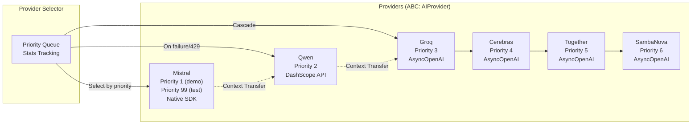
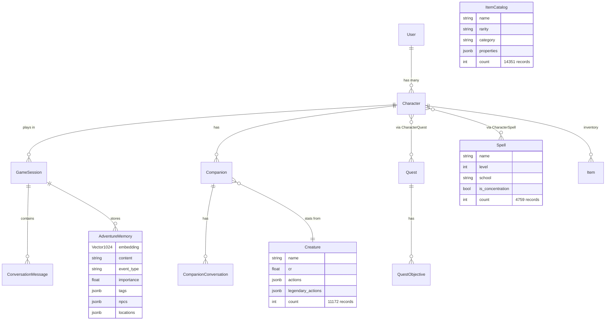
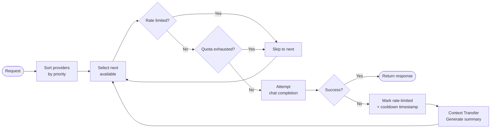
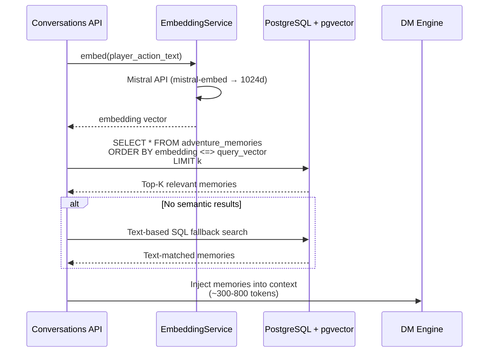

# Mistral Realms — Architecture

> Last updated: February 28, 2026

---

## System Overview

```mermaid
graph TB
    subgraph "Client Layer"
        FE["Next.js 16 / React 19<br/>8 routes · 40+ components"]
    end

    subgraph "API Layer — FastAPI"
        direction TB
        MW["Middleware Stack (9 layers)<br/>CORS · HTTPS · CSRF · Rate Limit<br/>Observability · Performance · Language<br/>Error Logger · Query Monitor"]

        subgraph "Endpoints (80+)"
            AUTH_EP[Auth<br/>7 endpoints]
            CONV_EP[Conversations<br/>5 endpoints]
            CHAR_EP[Characters<br/>10 endpoints]
            SESS_EP[Sessions<br/>8 endpoints]
            SPELL_EP[Spells<br/>10 endpoints]
            INV_EP[Inventory<br/>5 endpoints]
            COMP_EP[Companions<br/>7 endpoints]
            DICE_EP[Dice<br/>2 endpoints]
            IMG_EP[Images · Memories<br/>NPCs · Loot · Rules]
        end
    end

    subgraph "Service Layer (42 services)"
        direction TB
        subgraph "AI Engine"
            DM["DM Engine<br/>1,991 lines"]
            TE["Tool Executor<br/>16 tools"]
            SUP["DM Supervisor<br/>Rule validation"]
            PRE["DM Preheater<br/>Warmup priming"]
            ADPT["Adaptive Narration"]
        end

        subgraph "Provider Architecture"
            PS["Provider Selector<br/>Priority fallback"]
            MP["Mistral Provider<br/>Native SDK"]
            QP["Qwen Provider<br/>DashScope"]
            GP["Groq · Cerebras<br/>Together · SambaNova"]
            CT["Context Transfer"]
            MD["Model Discovery"]
        end

        subgraph "Intelligence"
            EMB["Embedding Service<br/>mistral-embed 1024d"]
            MEM["Memory Service<br/>RAG + pgvector"]
            SEM["Semantic Search<br/>MiniLM-L12 384d"]
            CWM["Context Window Manager<br/>tiktoken 28K"]
            SUMM["Summarization"]
        end

        subgraph "Game Mechanics"
            ROLL["Roll Parser + Executor"]
            RNG["Random Pool<br/>Random.org"]
            COMP_S["Companion Service"]
            EFF["Effects Service"]
            SAVE["Save Service"]
            CL["Content Linker"]
        end

        subgraph "Image Pipeline"
            IS["Image Service<br/>Mistral Agent API"]
            ID["Image Detection<br/>Scene similarity"]
        end
    end

    subgraph "Data Layer"
        PG[("PostgreSQL 16 + pgvector<br/>14K items · 11K monsters<br/>4K spells · memories")]
        RD[("Redis 7<br/>Sessions · State<br/>Provider exhaustion")]
    end

    subgraph "Observability"
        JAE["Jaeger<br/>Distributed traces"]
        PROM["Prometheus<br/>40+ metrics"]
        GRAF["Grafana<br/>Dashboards"]
    end

    FE -->|HTTP/JSON| MW
    MW --> AUTH_EP & CONV_EP & CHAR_EP & SESS_EP & SPELL_EP & INV_EP & COMP_EP & DICE_EP & IMG_EP

    CONV_EP --> DM
    DM --> TE & SUP & PRE & ADPT
    DM --> PS
    PS --> MP & QP & GP
    PS --> CT

    CONV_EP --> MEM --> EMB
    CONV_EP --> ID --> IS
    IS --> MP

    DM --> CWM & SUMM
    TE --> SEM & ROLL & COMP_S & EFF
    ROLL --> RNG

    EMB --> PG
    SEM --> PG
    MEM --> PG
    CHAR_EP & SESS_EP & SPELL_EP --> PG
    CONV_EP --> RD

    DM -.->|traces| JAE
    MW -.->|metrics| PROM
    PROM --> GRAF
```



---

## Layer-by-Layer Breakdown

### 1. API Layer

FastAPI with 80+ endpoints under `/api/v1/`. 9 middleware layers applied in order:

| Order | Middleware | Function |
|-------|-----------|----------|
| 1 | CORS | Origin validation from `CORS_ORIGINS` |
| 2 | HTTPS Enforcement | HTTP→HTTPS redirect in production, HSTS `max-age=31536000` |
| 3 | CSRF | Double submit cookie pattern, `secrets.compare_digest()` |
| 4 | Error Logger | Full stack traces + request context to `/app/logs/errors/` |
| 5 | Language | i18n via `Accept-Language` header parsing with quality values |
| 6 | Observability | UUID correlation IDs (`X-Request-ID`), Prometheus HTTP metrics |
| 7 | Rate Limiting | IP/user sliding window, per-endpoint limits, DDoS burst block |
| 8 | Performance | Request timing, slow detection (>1s warn, >3s error), `X-Process-Time` |
| 9 | Query Monitor | SQLAlchemy event listeners: slow query (>500ms), N+1 (>10 queries) |

### 2. Service Layer

42 services organized by concern:

```
services/
├── AI Engine:       dm_engine.py, tool_executor.py, dm_supervisor.py, dm_preheater.py, adaptive_narration_service.py
├── Providers:       mistral_provider.py, mistral_client.py, qwen_provider.py, groq_provider.py, cerebras_provider.py,
│                    together_provider.py, sambanova_provider.py, ai_provider.py, provider_selector.py, provider_init.py
├── Intelligence:    memory_service.py, embedding_service.py, semantic_search_service.py, context_window_manager.py,
│                    token_counter.py, summarization_service.py, message_summarizer.py, context_transfer.py
├── Images:          image_service.py, image_detection_service.py
├── Game Mechanics:  roll_parser.py, roll_executor.py, dice_service.py, random_pool.py, companion_service.py,
│                    content_linker.py, effects_service.py, save_service.py
├── Infrastructure:  redis_service.py, auth_service.py, model_discovery_service.py
└── Tools:           dm_tools.py (16 tool schemas)
```

### 3. AI Providers



**Selection algorithm**:
1. Sort providers by priority (ascending)
2. Skip providers that are rate-limited (check cooldown timestamp)
3. Skip providers with exhausted quotas (Qwen: permanent Redis tracking)
4. Attempt chat completion with selected provider
5. On failure: mark provider as rate-limited → select next → `ContextTransferService` generates session summary → inject into new provider context
6. Track per-provider statistics (requests, successes, failures, switches)

### 4. Database Layer

PostgreSQL 16 with pgvector extension. Async via `asyncpg` + SQLAlchemy 2.0.



### 5. Cache Layer (Redis)

| Key Pattern | Purpose | TTL |
|------------|---------|-----|
| `session:{id}:state` | Game state (JSONB) | 24h |
| `session:{id}:messages` | Conversation history list | 24h |
| `provider:{name}:exhausted:{model}` | Qwen model exhaustion flags | None (permanent) |
| `model_discovery:{provider}` | Cached model lists | 24h |

---

## Complete DM Engine Flow

```mermaid
flowchart TB
    START([Player action arrives]) --> LOAD[Load character, session,<br/>companions, quests, effects]
    LOAD --> RAG[RAG Memory Retrieval<br/>embed action → pgvector search]
    RAG --> SUMM{Messages > 20<br/>AND near 28K?}
    SUMM -->|Yes| SUMMARIZE[Summarize older messages<br/>via LLM]
    SUMM -->|No| BUILD
    SUMMARIZE --> BUILD

    BUILD[Build Message Context] --> SYS[System prompt ~1500 tokens<br/>Bilingual EN+FR]
    SYS --> CHAR[Character context ~200-500t<br/>Stats, inventory, equipped]
    CHAR --> STATE[Game state ~200-400t<br/>Quests, companions, effects]
    STATE --> MEM[Memory context ~300-800t<br/>RAG-retrieved memories]
    MEM --> WARM{First turn?}
    WARM -->|Yes| PREHEAT[Inject 5 warmup exchanges<br/>DM Preheater]
    WARM -->|No| REMIND
    PREHEAT --> REMIND
    REMIND{Turn % 10 == 0?} -->|Yes| RULES[Inject tool usage<br/>reminder]
    REMIND -->|No| HIST
    RULES --> HIST
    HIST[Conversation history<br/>Token-pruned] --> USER[User message]
    USER --> COUNT[Token counting<br/>tiktoken cl100k_base]
    COUNT --> PRUNE{> 28K tokens?}
    PRUNE -->|Yes| FIFO[FIFO pruning<br/>Keep system + last N]
    PRUNE -->|No| CALL
    FIFO --> CALL

    CALL[Provider Selector<br/>→ AI Provider] --> TOOLS{Response has<br/>tool_calls?}

    TOOLS -->|Yes| EXEC[Tool Executor<br/>execute_tool]
    EXEC --> APPEND[Append tool result<br/>to messages]
    APPEND --> ITER{Iteration < 10?}
    ITER -->|Yes| CALL
    ITER -->|No| FORCE[Force text response]

    TOOLS -->|No text tools| REGEX[Parse text-based<br/>tool calls via regex]
    REGEX --> FOUND{Found?}
    FOUND -->|Yes| EXEC
    FOUND -->|No| CONTENT{Has content?}

    TOOLS -->|Has content| VALIDATE
    CONTENT -->|Yes| VALIDATE
    CONTENT -->|No| ADAPTIVE[Adaptive Narration<br/>Generate from templates]
    ADAPTIVE --> VALIDATE
    FORCE --> VALIDATE

    VALIDATE[DM Supervisor<br/>9 regex patterns] --> VALID{Confidence ≥ 0.7?}
    VALID -->|Yes| EXTRACT
    VALID -->|No| INJECT[Inject rule reminders<br/>Silent regeneration]
    INJECT --> CALL

    EXTRACT[Extract ROLL and<br/>QUEST_COMPLETE tags] --> DETECT[Scene Detection<br/>Embedding similarity]
    DETECT --> SIG{Similarity ≥ 0.5?}
    SIG -->|Yes| IMAGE[Image Service<br/>Mistral Agent API]
    SIG -->|No| SAVE
    IMAGE --> SAVE[Save message + memory<br/>DB + Redis]
    SAVE --> RESPONSE([DMResponse<br/>narration · rolls · image · state])
```



---

## Provider Selection Algorithm



---

## Memory Retrieval Flow



---

## Image Generation Pipeline

```mermaid
flowchart TB
    MSG([DM narration text]) --> DET[Image Detection Service<br/>sentence-transformers model]
    DET --> EMB[Embed narration against<br/>18 scene templates]
    EMB --> SIM{Cosine similarity<br/>≥ 0.5?}
    SIM -->|No| SKIP([No image generated])
    SIM -->|Yes| HASH[Compute prompt hash]
    HASH --> DUP{Hash exists<br/>in cache?}
    DUP -->|Yes| REUSE([Return cached image<br/>increment reuse count])
    DUP -->|No| COOL{In 429<br/>cooldown?}
    COOL -->|Yes| SKIP2([Skip — cooldown active])
    COOL -->|No| QUOTA{Hourly quota<br/>reached?}
    QUOTA -->|Yes| SKIP3([Skip — quota exhausted])
    QUOTA -->|No| AGENT[Mistral Agent API<br/>"D&D Scene Illustrator"<br/>image_generation tool]
    AGENT --> STORE[Store image + metadata<br/>in generated_images table]
    STORE --> DONE([Return image URL])

    AGENT -->|429 response| TRACK[Set 5-min cooldown<br/>timestamp]
    TRACK --> SKIP2
```

---

## Data Model Overview

### Key Tables

| Table | Records | Key Columns | Purpose |
|-------|---------|-------------|---------|
| `users` | Dynamic | `email`, `username`, `password_hash`, `is_guest`, `guest_token` | Auth with guest→registered claiming |
| `characters` | Dynamic | 6 ability scores, `hp`/`max_hp`, `ac`, `level`, `xp`, `spell_slots` (JSONB), `skill_proficiencies` (JSONB), personality | Full D&D 5e character sheet |
| `game_sessions` | Dynamic | `character_id`, `is_active`, `current_location`, `state_snapshot` (JSONB) | Links to Redis state |
| `conversation_messages` | Dynamic | `session_id`, `role`, `content`, `tokens_used`, `scene_image_url`, `companion_id` | Full conversation history |
| `adventure_memories` | Dynamic | `content`, `embedding` (Vector 1024d), `event_type`, `importance`, `tags`/`npcs`/`locations` (JSONB) | RAG memory system |
| `companions` | Dynamic | `creature_id`, `personality`, `loyalty` (0-100), 6 abilities, `hp`, `conversation_memory` (JSONB) | AI NPCs with combat stats |
| `quests` | Dynamic | `title`, `state` (enum), `rewards` (JSONB) | Quest tracking |
| `creatures` | 11,172 | Full stat block: `cr`, `ac`, `hp`, `actions`, `legendary_actions`, `traits` | D&D 5e monster database |
| `item_catalog` | 14,351 | `name`, `rarity`, `category`, `damage_dice`, `ac_base`, `properties` (JSONB) | D&D 5e item database |
| `spells` | 4,759 | `name`, `level`, `school`, `is_concentration`, `damage_dice`, `upcast_damage` | D&D 5e spell database |
| `active_effects` | Dynamic | `character_id`, `source_type`, `effect_type`, `duration`, `concentration` | Spell effects lifecycle |
| `generated_images` | Dynamic | `prompt_hash`, `image_url`, `reuse_count` | Image cache with deduplication |

### Enums
- `CharacterClass`: 12 D&D classes (Barbarian through Wizard)
- `CharacterRace`: 9 races (Human through Tiefling)
- `SpellSchool`: 8 schools (Abjuration through Transmutation)
- `ConditionType`: 14 D&D conditions (Blinded through Unconscious)
- `QuestState`: not_started → in_progress → completed/failed
- `MessageRole`: user, assistant, system, companion
- `EventType`: 10 types including summary

---

## Cross-Cutting Concerns

### Authentication
- JWT access tokens (30 min) in httpOnly cookies
- Refresh tokens (7 days)
- Guest mode with `guest_token`, claimable to full accounts
- bcrypt password hashing
- CSRF double-submit cookie with `secrets.compare_digest()`

### Observability
- **Tracing**: OpenTelemetry → OTLP gRPC → Jaeger. Auto-instrumented: FastAPI, HTTPX, Redis, SQLAlchemy. Custom `@trace_async` decorator and `trace_llm_call()` for LLM-specific spans.
- **Metrics**: 40+ Prometheus metrics across HTTP, LLM, DB, Redis, rate limits, auth, sessions, companions, spells, DM tools, images.
- **Logging**: Structured key=value format. ContextVars propagate `request_id`, `user_id`, `session_id`, `character_id` through async chains.
- **Alerts**: 15 Prometheus rules in 6 groups (HTTP errors, LLM errors, DB latency, companion system, spell system, image generation, infrastructure).

### Error Handling
- Global exception handler with structured error responses
- Per-request error logging to `/app/logs/errors/` with full stack traces, request context, exception chains
- Defensive coding throughout: graceful degradation on service failures (Random.org → `random.randint()`, semantic search → text search, provider fallback chains)

### Rate Limiting
- Global: 60/min, 1,000/hr
- Per-endpoint: login (5/min), register (3/min), image gen (5/hr), adventure starts (10/hr)
- DDoS burst protection: 20 requests in 10s → 5-minute IP block
- `Retry-After` headers on 429 responses
- `X-Forwarded-For` aware for proxied environments

### Performance
- Slow request detection: >1s warning, >3s error
- `X-Process-Time` response header
- SQLAlchemy query monitoring: >500ms warning, >2s error, N+1 detection (>10 queries per request)

---

## Infrastructure

### Production Stack (7 services)

| Service | Image | Ports | Health Check |
|---------|-------|-------|-------------|
| PostgreSQL | `pgvector/pgvector:pg16` | 5432 | `pg_isready` (10s) |
| Redis | `redis:7-alpine` | 6379 | `redis-cli ping` (10s) |
| Backend | Custom 2-stage (`python:3.13-slim`) | 8000 | `/health` (30s) |
| Frontend | Custom 3-stage (`node:20-alpine`) | 3000 | HTTP check (30s) |
| Jaeger | `jaegertracing/all-in-one:1.53` | 16686, 4317, 4318 | — |
| Prometheus | `prom/prometheus:v2.48.1` | 9090 | — |
| Grafana | `grafana/grafana:10.2.3` | 3001 | — |

### Dependency Chain
```
postgres (healthy) ──┐
                     ├──▶ backend (healthy) ──▶ frontend
redis (healthy) ─────┘
                     prometheus ──▶ grafana
                     jaeger (independent)
```

### Docker Build Optimization
- **Backend**: 2-stage build. Builder installs `gcc`, `g++`, `libpq-dev`, pip packages. Production copies deps only, creates non-root `appuser` (UID 1000). CPU-only PyTorch (`CUDA_VISIBLE_DEVICES=""`).
- **Frontend**: 3-stage build. `npm ci --only=production` → full build → standalone bundle with non-root `nextjs` user (UID 1001).
